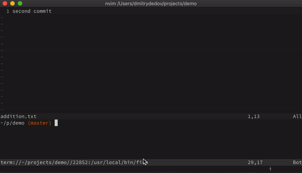

# Git FastFix

This is a Neovim plugin for applying "fast git fixups"(using UI) to the current development branch.



## Installation

Add plugin to the runtime path

### Vim-Plug 

```VimL
Plug 'dm1try/git_fastfix'

```

load lua module and map `OpenGitFastFixWindow()`
```VimL
lua require'git_fastfix'
nn <silent> <leader>gf :lua OpenGitFastFixWindow()<cr>
```


